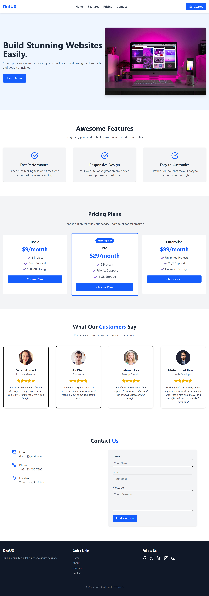

# DotUX Landing Page 🚀

Welcome to the **DotUX Landing Page**, a sleek and modern landing page built with **React** and **Tailwind CSS**. This project showcases a beautiful UI and responsive layout, ideal for promoting your digital product or service.

## 🌟 Project Overview

DotUX is a fictional web service designed to demonstrate how to build a landing page that is fast, responsive, and easy to customize. It includes key sections every modern product site needs—from features and pricing to testimonials and contact information.

## 📸 Preview

 <!-- Add an actual screenshot path if available -->

## ✨ Features

- 💨 **Fast Performance** – Optimized assets and structure for blazing-fast load times.
- 📱 **Responsive Design** – Looks stunning on all screen sizes, from mobile to desktop.
- 🎨 **Easy to Customize** – Tailwind CSS makes tweaking layout and colors a breeze.
- 💬 **User Testimonials** – Authentic feedback from real users to build trust.
- 💼 **Pricing Section** – Clearly presented plans with CTAs.
- 📞 **Contact Form** – Simple form with email, phone, and location details.

## 🧱 Tech Stack

- **React JS**
- **Tailwind CSS**
- **HTML5 & JSX**
- **CSS3**
- **Responsive Web Design Principles**

## 📁 Folder Structure

Landing-Page-UI/
├── public/
│   ├── index.html
│   └── favicon.ico
│
├── src/
│   ├── assets/
│   │   ├── images/             # All images used in the UI
│   │   └── icons/              # Any SVG or icon files
│   │
│   ├── components/
│   │   ├── Header.jsx          # Navigation bar
│   │   ├── Hero.jsx            # Top section with heading and CTA
│   │   ├── Features.jsx        # Awesome features section
│   │   ├── Pricing.jsx         # Pricing cards
│   │   ├── Testimonials.jsx    # Customer feedback
│   │   ├── Contact.jsx         # Contact form
│   │   ├── Footer.jsx          # Footer with links and info
│   │   └── Button.jsx          # Reusable button component
│   │
│   ├── App.jsx                 # Root component
│   ├── main.jsx                # Entry point for React
│   └── index.css               # Tailwind imports and custom styles
│
├── .gitignore
├── package.json
├── README.md
└── vite.config.js              # If using Vite as build tool

## 🚀 Getting Started

1. **Clone the repository**

   git clone https://github.com/MuhammadIbrahimkha/Landing-Page-UI.git

2. **Install dependencies**

npm install

3. **Start the development server**

npm run dev

4. **Build for production**

npm run build

5. **Contact**

Email: muhammadibrahimmi2005@gmail.com
Phone: +92 123 456 7890
Location: Timergara, Pakistan

6. **Acknowledgements**

Special thanks to:

Sarah Ahmed – Product Manager

Ali Khan – Freelancer

Fatima Noor – Startup Founder

Muhammad Ibrahim – Web Developer

7. **License**

This project is open-source and available under the MIT License.

Crafted with ❤️ by Muhammad Ibrahim

